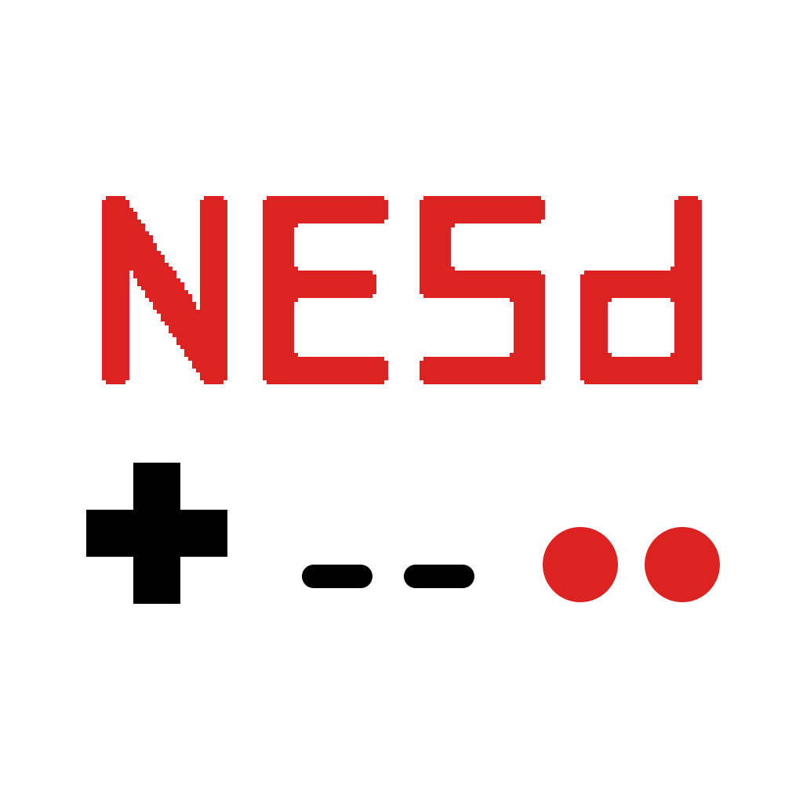
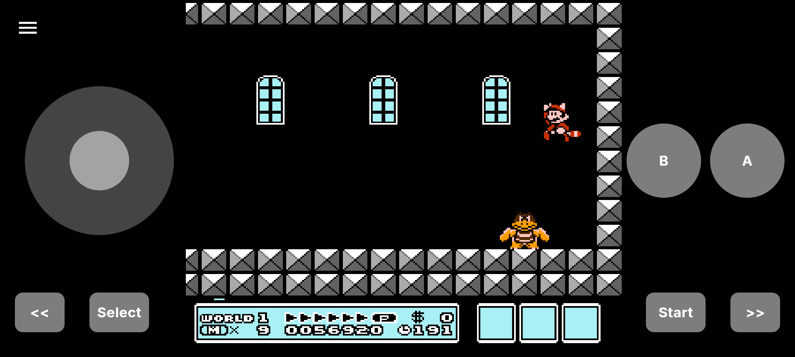
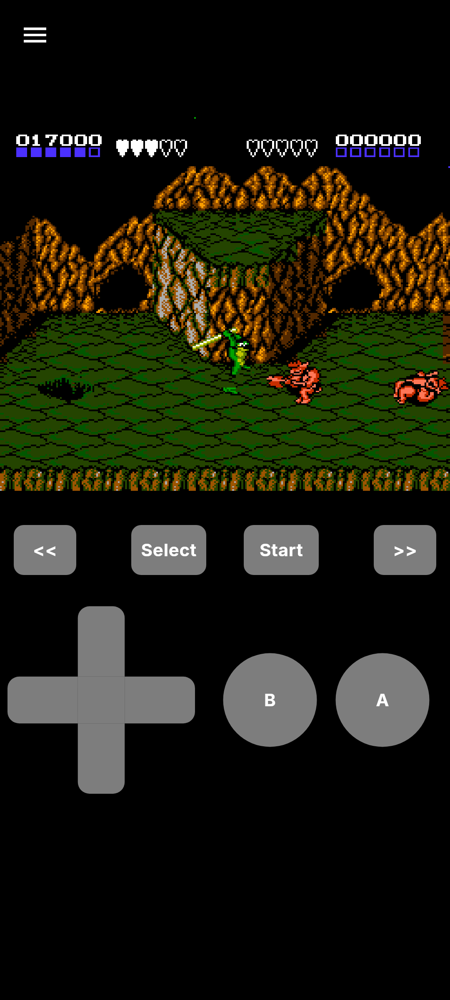
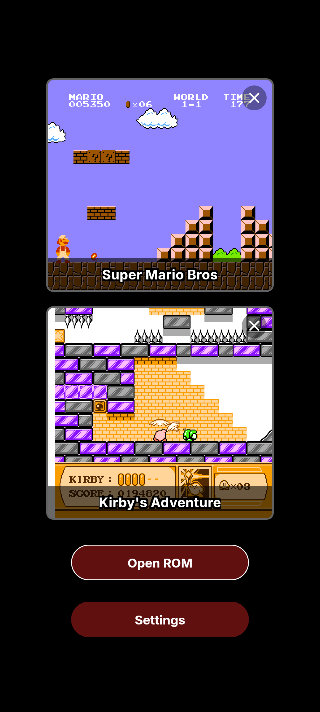
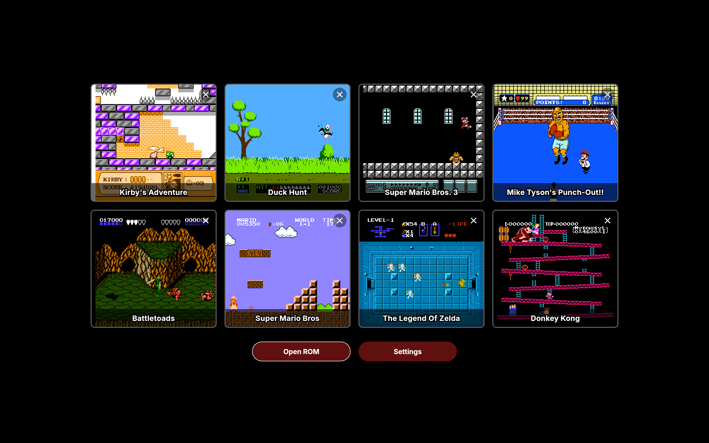
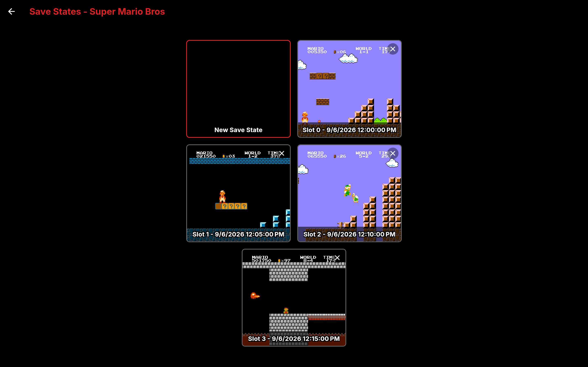
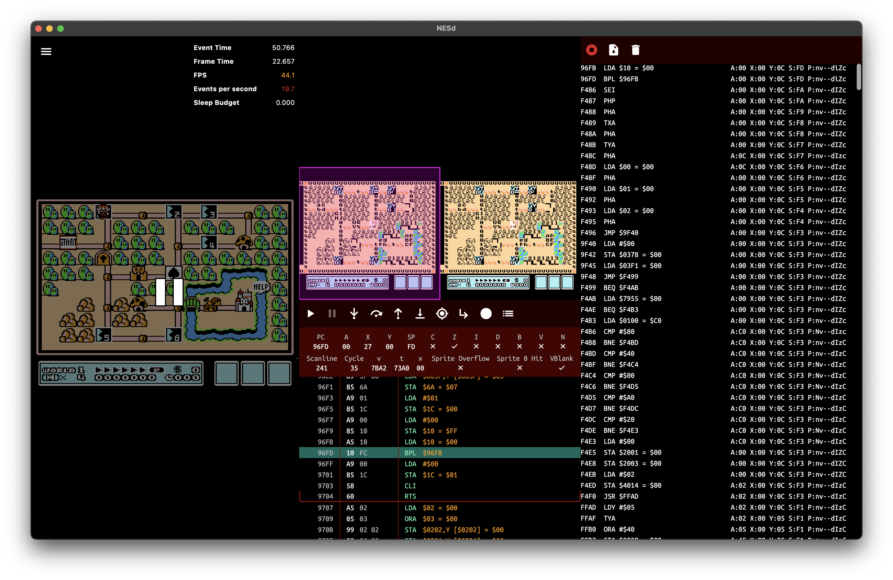

  

A NES Emulator written in Dart and Flutter.
Supports macOS, Windows, Android, Linux (tested on Steam Deck), and the web.  
If you sponsor an iOS device and the Apple developer account fee, I'll publish it to the App Store ;) 

> **Looking for Android testers!**  
> Google Play requires 12 testers to opt in and
> actually use the app for 14 days before a new app can be published. If you'd like
> to help NESd get onto the Play Store,
> sign up in [Discussions](https://github.com/jpjonte/NESd/discussions/322).  
> You'll need an Android device and a Google account.

## Installation

### macOS, Windows, Linux (deb / rpm), Android

Download NESd from the [latest release](https://github.com/jpjonte/NESd/releases/latest).

### Web

Play at [https://nesd.jpj.dev/play/](https://nesd.jpj.dev/play/). A self-hostable Docker image is also available (see [Self-hosting](#self-hosting) below).

### Linux (Flatpak)

Add my Flatpak repo (https://jpjonte.github.io/flatpak/jpj.flatpakrepo) and install NESd (`dev.jpj.NESd`) from there.

Nightly builds (`dev.jpj.NESd.dev`) live in the same repo and can be installed next to the stable release.

## Features

- Runs on macOS, Linux, Windows, Android, and the web
- Cycle accurate CPU emulation
- PPU and APU emulation
- Support for NTSC and PAL games
- SRAM saves
- Save states
- Customizable controls with multiple bindings per action
- Gamepad support
- Load ROMs from file or ZIP archive
- Customizable touch screen controls
- Debug overlay
- Debugging tools
  - Debugger
  - Execution Log

## Supported games and mappers

NESd supports 3.070 games.

- 0: NROM (336 games)
- 1: MMC1 (734 games)
- 2: UNROM (304 games)
- 3: CNROM (192 games)
- 4: MMC3 (763 games)
- 5: MMC5 (31 games)
- 7: AxROM (59 games)
- 9: MMC2 (9 games)
- 16: Bandai FCG (16 games)
- 19: Namco 163 (31 games)
- 45: GA23C (213 games)
- 66: GxROM (17 games)
- 71: BR909x (30 games)
- 118: TxSROM (8 games)
- 176: 8025 (264 games)
- 206: Namco 108 (63 games)

## Self-hosting

NESd's web version is a static Flutter web app that can be self-hosted.

### Docker

    docker run -d -p 8080:80 ghcr.io/jpjonte/nesd:latest

Then open http://localhost:8080.

`8080` is an example port, feel free to change it.

| Tags      |                                 | 
|-----------|---------------------------------|
| `latest`  | latest release                  |  
| `x.y.z`   | specific version, e.g. `0.17.0` |  
| `nightly` | latest `main` build             |

#### Docker Compose

    services:
      nesd:
        image: ghcr.io/jpjonte/nesd:latest
        ports:
          - "8080:80"
        restart: unless-stopped

### Static files

Any static file server works.

- Download the web build (`nesd.<version>.web.zip`) from the [latest release](https://github.com/jpjonte/NESd/releases/latest)
- or `nesd.nightly.web.zip` from the [nightly release](https://github.com/jpjonte/NESd/releases/tag/nightly)
- or build it from source (`flutter build web --wasm --no-web-resources-cdn` in `packages/nesd`).

Serve the directory as-is.  
`.mjs` files must be served as JavaScript (`Content-Type: application/javascript`), otherwise browsers reject the WebAssembly runtime's module, and you get a blank page.  
Serve `index.html` and `flutter_bootstrap.js` uncached.  
Serve over HTTPS (or localhost): browsers only provide audio worklets in secure contexts, **so on plain HTTP NESd runs without sound.**

## Acknowledgements

Thank you to the following projects and people for their amazing work:

- The [Nesdev Wiki](https://wiki.nesdev.com/w/index.php/Nesdev_Wiki) for the invaluable documentation
- The [Nesdev Forums](https://forums.nesdev.com/) for the in-depth discussions on hardware behaviors
- SourMesen for the excellent [Mesen](https://github.com/SourMesen/Mesen2/) emulator
- [Modern Vintage Gamer](https://www.youtube.com/@ModernVintageGamer) for the inspiration to write my own emulator
- NewRisingSun for the [NES 2.0 XML Database](https://forums.nesdev.org/viewtopic.php?t=19940) of known ROMs
- [Andrea Bizzotto](https://codewithandrea.com/) for his excellent Flutter tips and tricks

## Screenshots

### Android

  
  

### Desktop

 
 

