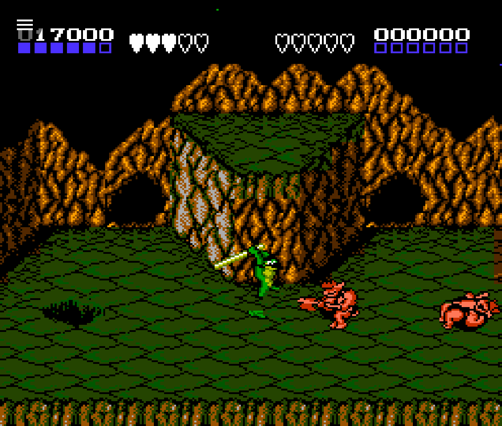
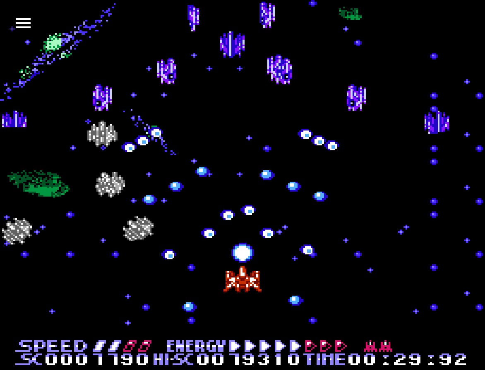
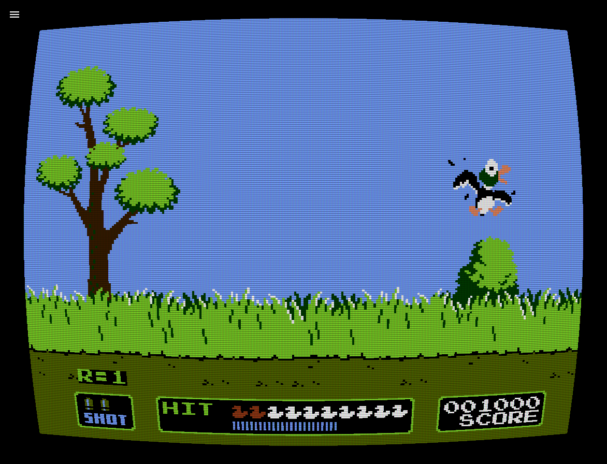
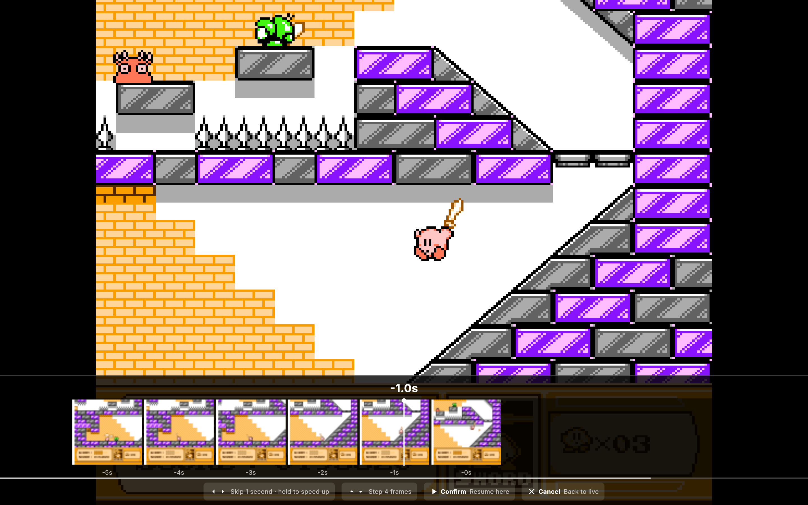
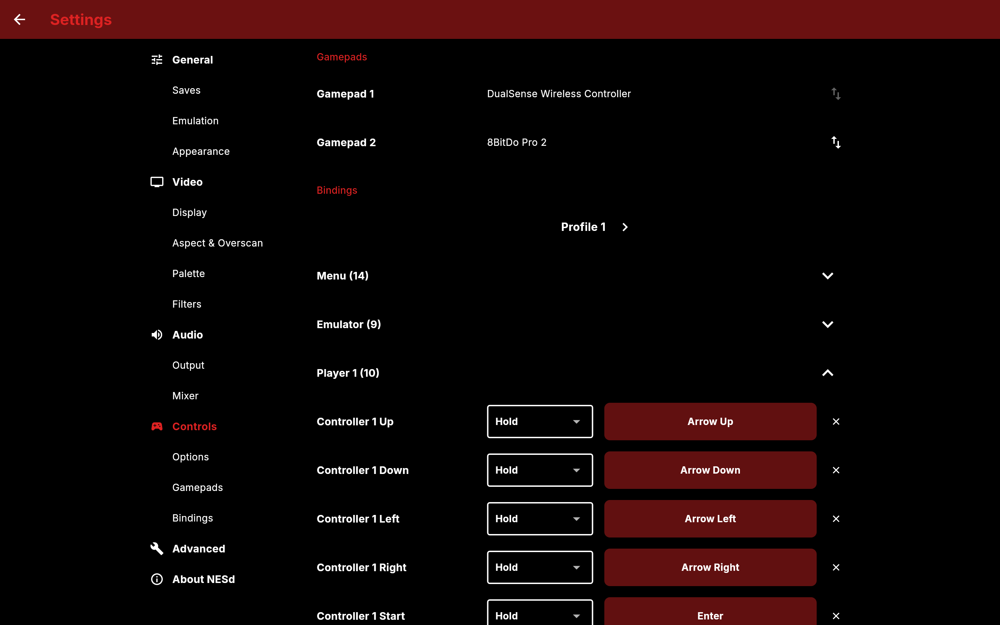

  

A cycle-accurate NES emulator written in Dart and Flutter.
Runs on macOS, Windows, Linux, Android, and on the web.

**[▶ Play it in your browser](https://nesd.jpj.dev/play/)**, [Download a build](#installation) or visit [nesd.jpj.dev](https://nesd.jpj.dev).

  
  

## Installation

### Downloads

Grab the file for your platform from the [latest release](https://github.com/jpjonte/NESd/releases/latest):

| Platform                     | File                                            |
|------------------------------|-------------------------------------------------|
| macOS (Intel + Apple Silicon)| `nesd.<version>.macos-universal.dmg`            |
| Windows                      | `nesd.<version>.windows-x64.zip`                |
| Linux (Debian, Ubuntu, …)    | `nesd.<version>.linux-<arch>.deb`               |
| Linux (Fedora, RHEL, …)      | `nesd.<version>.linux-<arch>.rpm`               |
| Linux (portable)             | `nesd.<version>.linux-<arch>.AppImage`          |
| Android                      | `nesd.<version>.android.apk`                    |
| Web (self-hosted)            | `nesd.<version>.web.zip`                        |

`<arch>` is `x64` or `arm64`. Nightly builds of `main` live in the
[nightly release](https://github.com/jpjonte/NESd/releases/tag/nightly).

### Web

Play at [https://nesd.jpj.dev/play/](https://nesd.jpj.dev/play/). A self-hostable Docker image is
also available (see [Self-hosting](#self-hosting) below).

### Android

> **Looking for Android testers!**  
> Google Play requires 12 testers to opt in and
> actually use the app for 14 days before a new app can be published. If you'd like
> to help NESd get onto the Play Store,
> sign up in [Discussions](https://github.com/jpjonte/NESd/discussions/322).  
> You'll need an Android device and a Google account.

### Linux (Flatpak)

Add my Flatpak repo (https://jpjonte.github.io/flatpak/jpj.flatpakrepo) and install NESd
(`dev.jpj.NESd`) from there.

Nightly builds (`dev.jpj.NESd.dev`) live in the same repo and can be installed next to the stable
release.

### First launch

NESd's desktop builds are not signed, so your OS will complain the first time you open the app. It only happens once.

- **macOS**: right-click the app and choose *Open*. If macOS insists the app is damaged, clear the quarantine flag in the Terminal: `xattr -dr com.apple.quarantine /Applications/NESd.app`
- **Windows**: SmartScreen shows a blue warning. Choose *More info* → *Run anyway*.

## Getting started

NESd does not come with any games. It plays `.nes` ROM files you supply yourself. Open one with **Open ROM** and it is added to your library.

### Default keyboard controls

| Action              | Key                        |
|---------------------|----------------------------|
| D-pad               | Arrow keys                 |
| A / B               | <kbd>Z</kbd> / <kbd>X</kbd>|
| Start / Select      | <kbd>Enter</kbd> / <kbd>Shift</kbd> |
| Pause               | <kbd>Space</kbd>           |
| Fast-forward        | <kbd>Tab</kbd>             |
| Rewind              | <kbd>Backspace</kbd>       |
| Open menu           | <kbd>Esc</kbd>             |
| Load save state 1–9 | <kbd>1</kbd> … <kbd>9</kbd>|
| Save to state 1–9   | <kbd>Shift</kbd> + <kbd>1</kbd> … <kbd>9</kbd> |

All controls can be changed under **Settings → Controls**, including gamepads and the on-screen touch controls.

## Features

- Cycle-accurate CPU, PPU and APU emulation
- Runs on macOS, Linux, Windows, Android and the web
- Support for NTSC and PAL games
- Battery backed (SRAM) saves
- Save states, with thumbnails
- Rewind
- Fast-forward at 2x, 3x, 4x or unlimited, with audio
- Game Genie cheats
- Video filters (CRT and Smoothing) that can be stacked
- Expansion audio for MMC5 and Namco 163 games
- Customizable controls with multiple bindings per action
- Gamepad support
- Customizable touch screen controls
- Turbo A and B for both controllers, with an adjustable fire rate
- Load ROMs from file or ZIP archive, with a searchable file picker
- Debug overlay and debug tools: Display, Tile Viewer, Cartridge Info, APU Debug, Debugger and Execution Log
- A log viewer with search, copy and file export

## Screenshots

### Desktop

 
 

### Android

  

## Supported games and mappers

<!-- game-counts:start -->

NESd supports 3,404 games.

Supported mappers

- 0: NROM (346 games)
- 1: MMC1 (734 games)
- 2: UNROM (303 games)
- 3: CNROM (192 games)
- 4: MMC3 (796 games)
- 5: MMC5 (31 games)
- 7: AxROM (59 games)
- 9: MMC2 (9 games)
- 16: Bandai FCG (16 games)
- 19: Namco 163 (31 games)
- 30: UNROM 512 (39 games)
- 45: GA23C (151 games)
- 66: GxROM (17 games)
- 71: BR909x (30 games)
- 118: TxSROM (8 games)
- 176: 8025 (344 games)
- 206: Namco 108 (63 games)
- 256: VT03 OneBus (235 games)

<!-- game-counts:end -->

## Accuracy

<!-- test-roms:start -->

120 of 124 test ROMs run in CI and pass.

Test ROM results

The ROMs live in `roms/test/`, the tests that run them in `packages/nesd/test/test_roms/`.
*Passing* counts the ROMs of a suite that run in CI and pass, out of the ROMs the suite ships.

| Area | Suite | Author | Passing | Notes |
|------|-------|--------|---------|-------|
| CPU | `instr_test-v5` | blargg | 1 / 1 | `all_instrs`, all 16 sub-tests, official and unofficial opcodes |
| CPU | `instr_timing` | blargg | 1 / 1 | Combined ROM, both sub-tests |
| CPU | `branch_timing_tests` | blargg | 3 / 3 | |
| CPU | `instr_misc` | blargg | 4 / 4 | |
| CPU | `cpu_timing_test6` | blargg | 1 / 1 | Official and unofficial opcodes |
| CPU | `blargg_nes_cpu_test5` | blargg | 1 / 1 | `cpu`, official and unofficial opcodes |
| CPU | `nestest` | kevtris | 1 / 1 | Official and unofficial opcodes |
| CPU | `cpu_interrupts_v2` | blargg | 5 / 5 | |
| CPU | `cpu_reset` | blargg | 2 / 2 | |
| CPU | `cpu_dummy_reads` | blargg | 1 / 1 | |
| CPU | `cpu_dummy_writes` | bisqwit | 2 / 2 | |
| CPU | `cpu_exec_space` | bisqwit | 2 / 2 | |
| CPU | `sprdma_and_dmc_dma` | blargg | 2 / 2 | |
| CPU | `dmc_dma_during_read4` | blargg | 4 / 5 | `double_2007_read` needs the back-to-back `$2007` read quirk |
| PPU | `ppu_vbl_nmi` | blargg | 10 / 10 | |
| PPU | `vbl_nmi_timing` | blargg | 7 / 7 | Older release of `ppu_vbl_nmi` |
| PPU | `ppu_open_bus` | blargg | 1 / 1 | |
| PPU | `ppu_read_buffer` | bisqwit | 1 / 1 | 79 sub-tests |
| PPU | `oam_read` | blargg | 1 / 1 | |
| PPU | `oam_stress` | blargg | 1 / 1 | |
| PPU | `blargg_ppu_tests_2005.09.15b` | blargg | 4 / 5 | `power_up_palette` compares against one console's power-up palette |
| PPU | `sprite_hit_tests_2005.10.05` | blargg | 11 / 11 | |
| PPU | `sprite_overflow_tests` | blargg | 5 / 5 | |
| PPU | `scanline` | Quietust | 1 / 1 | Framebuffer golden |
| PPU | `full_palette` | blargg | 1 / 1 | Framebuffer golden |
| PPU | `spritecans-2011` | tepples | 1 / 1 | Framebuffer golden |
| APU | `apu_test` | blargg | 8 / 8 | |
| APU | `apu_reset` | blargg | 6 / 6 | |
| APU | `blargg_apu_2005.07.30` | blargg | 11 / 11 | Older release of `apu_test` |
| APU | `pal_apu_tests` | blargg | 10 / 10 | Run as a PAL console |
| Mapper | `mmc3_test` | blargg | 5 / 6 | `6-MMC6` targets the MMC6 IRQ revision |
| Mapper | `mmc3_test_2` | blargg | 5 / 6 | Newer build of the `mmc3_test` ROMs, `6-MMC3_alt` targets the alternate IRQ revision |
| Mapper | `mmc5test_v2` | AWJ | 1 / 1 | Framebuffer golden |

<!-- test-roms:end -->

## Self-hosting

NESd's web version is a static Flutter web app that can be self-hosted.

### Docker

    docker run -d -p 8080:80 ghcr.io/jpjonte/nesd:latest

Then open http://localhost:8080.

`8080` is an example port, feel free to change it.

| Tags      |                                 | 
|-----------|---------------------------------|
| `latest`  | latest release                  |  
| `x.y.z`   | specific version, e.g. `0.17.0` |  
| `nightly` | latest `main` build             |

#### Docker Compose

    services:
      nesd:
        image: ghcr.io/jpjonte/nesd:latest
        ports:
          - "8080:80"
        restart: unless-stopped

### Static files

Any static file server works.

- Download the web build (`nesd.<version>.web.zip`) from the [latest release](https://github.com/jpjonte/NESd/releases/latest)
- or `nesd.nightly.web.zip` from the [nightly release](https://github.com/jpjonte/NESd/releases/tag/nightly)
- or build it from source (`flutter build web --wasm --no-web-resources-cdn` in `packages/nesd`).

Serve the directory as-is.  
`.mjs` files must be served as JavaScript (`Content-Type: application/javascript`), otherwise browsers reject the WebAssembly runtime's module, and you get a blank page.  
Serve `index.html` and `flutter_bootstrap.js` uncached.  

## Contributing

Contributions are very welcome! See [CONTRIBUTING.md](CONTRIBUTING.md) for the development setup and how to report bugs (please include the log).

## Acknowledgements

Thank you to the following projects and people for their amazing work:

- The [Nesdev Wiki](https://wiki.nesdev.com/w/index.php/Nesdev_Wiki) for the invaluable documentation
- The [Nesdev Forums](https://forums.nesdev.com/) for the in-depth discussions on hardware behaviors
- SourMesen for the excellent [Mesen](https://github.com/SourMesen/Mesen2/) emulator
- [Modern Vintage Gamer](https://www.youtube.com/@ModernVintageGamer) for the inspiration to write my own emulator
- NewRisingSun for the [NES 2.0 XML Database](https://forums.nesdev.org/viewtopic.php?t=19940) of known ROMs
- blargg, bisqwit, kevtris, Quietust, tepples and AWJ for the [test ROMs](#accuracy) that keep the emulation honest
- [Andrea Bizzotto](https://codewithandrea.com/) for his excellent Flutter tips and tricks

## License

NESd is released under the [MIT License](LICENSE).

Nintendo Entertainment System and NES are trademarks of Nintendo. NESd is not affiliated with or endorsed by Nintendo, and ships no game ROMs or copyrighted Nintendo material.
