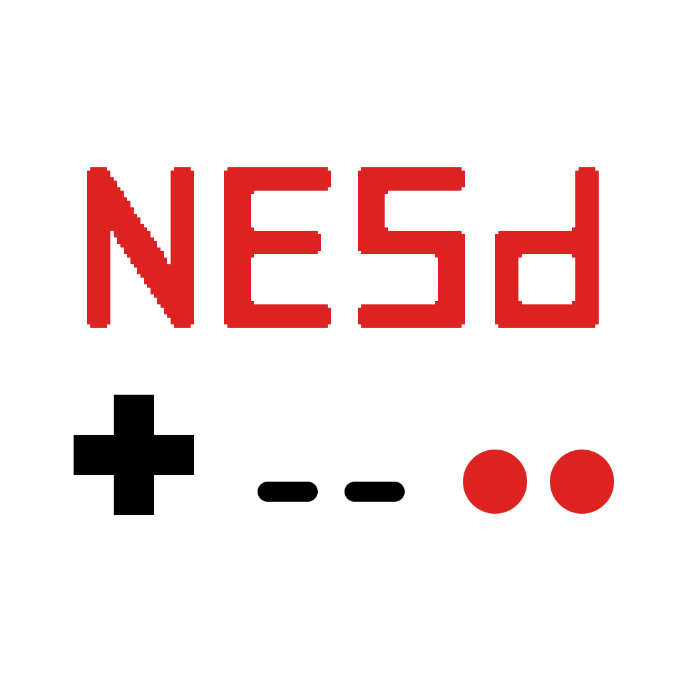

  

A NES Emulator written in Dart and Flutter.
Supports macOS, Windows, Android and Linux (tested on Steam Deck).  
Coming to the Google Play Store and the web in 2025.  
If you sponsor an iOS device and the Apple developer account fee, I'll publish it to the App Store ;) 

## Installation

### macOS, Windows, Linux (deb / rpm), Android

Download NESd from the [latest release](https://github.com/jpjonte/NESd/releases/latest).

### Linux (Flatpak)

Add my Flatpak repo (https://jpjonte.github.io/flatpak/jpj.flatpakrepo) and install NESd (`dev.jpj.NESd`) from there.

## Features

- Runs on macOS, Linux, Windows, and Android
- Cycle accurate CPU emulation
- PPU and APU emulation
- Support for NTSC and PAL games
- SRAM saves
- Save states
- Customizable controls with multiple bindings per action
- Gamepad support
- Load ROMs from file or ZIP archive
- Customizable touch screen controls
- Debug overlay
- Debugging tools
  - Debugger
  - Execution Log

## Supported games and mappers

NESd supports 2.480 games.

- 0: NROM (319 games)
- 1: MMC1 (734 games)
- 2: UNROM (303 games)
- 3: CNROM (191 games)
- 4: MMC3 (737 games)
- 5: MMC5 (31 games)
- 7: AxROM (59 games)
- 9: MMC2 (9 games)
- 19: Namco 163 (31 games)
- 66: GxROM (17 games)
- 71: BR909x (19 games)
- 206: Namco 108 (61 games)

## Acknowledgements

Thank you to the following projects and people for their amazing work:

- The [Nesdev Wiki](https://wiki.nesdev.com/w/index.php/Nesdev_Wiki) for the invaluable documentation
- The [Nesdev Forums](https://forums.nesdev.com/) for the in-depth discussions on hardware behaviors
- SourMesen for the excellent [Mesen](https://github.com/SourMesen/Mesen2/) emulator
- [Modern Vintage Gamer](https://www.youtube.com/@ModernVintageGamer) for the inspiration to write my own emulator
- NewRisingSun for the [NES 2.0 XML Database](https://forums.nesdev.org/viewtopic.php?t=19940) of known ROMs
- [Andrea Bizzotto](https://codewithandrea.com/) for his excellent Flutter tips and tricks

## Screenshots

### Android

  
  

### macOS

 
 

