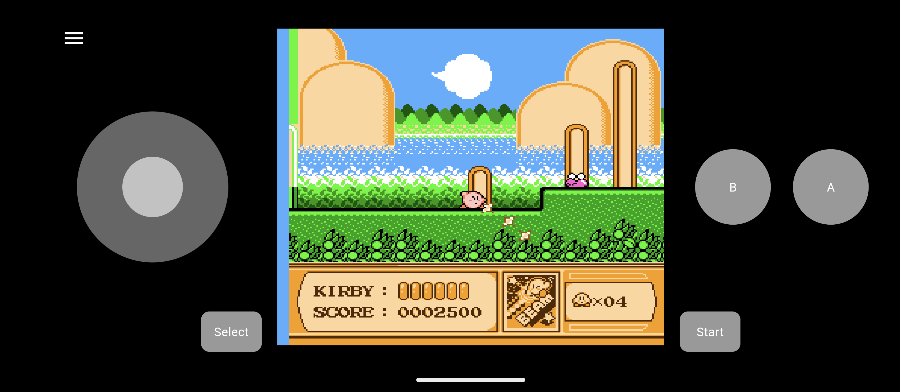

  

A NES Emulator written in Dart and Flutter.
Supports macOS, Windows, Android and Linux (tested on Steam Deck).  
If you sponsor an iOS device and the Apple developer account fee, I'll add iOS support ;) 

## Features

- Runs on macOS, Linux, Windows, and Android
- Cycle accurate CPU emulation
- PPU, and APU emulation
- SRAM saves
- Save states
- Customizable controls with multiple bindings per action
- Gamepad support
- Load ROMs from file or ZIP archive
- Customizable touch screen controls
- Debug overlay
- Debugging tools
  - Debugger
  - Execution Log

## Supported mappers

- NROM (0)
- MMC1 (1)
- UNROM (2)
- CNROM (3)
- MMC3 (4)
- AxROM (7)
- MMC2 (9)
- GxROM (66)
- BR909x (71)
- Namco108 (206)

## Acknowledgements

Thank you to the following projects and people for their amazing work:

- The [Nesdev Wiki](https://wiki.nesdev.com/w/index.php/Nesdev_Wiki) for the invaluable documentation
- SourMesen for the excellent [Mesen](https://github.com/SourMesen/Mesen2/) emulator
- [Modern Vintage Gamer](https://www.youtube.com/@ModernVintageGamer) for the inspiration to write my own emulator

## Screenshots

## Android

  
  

## macOS

 
 

